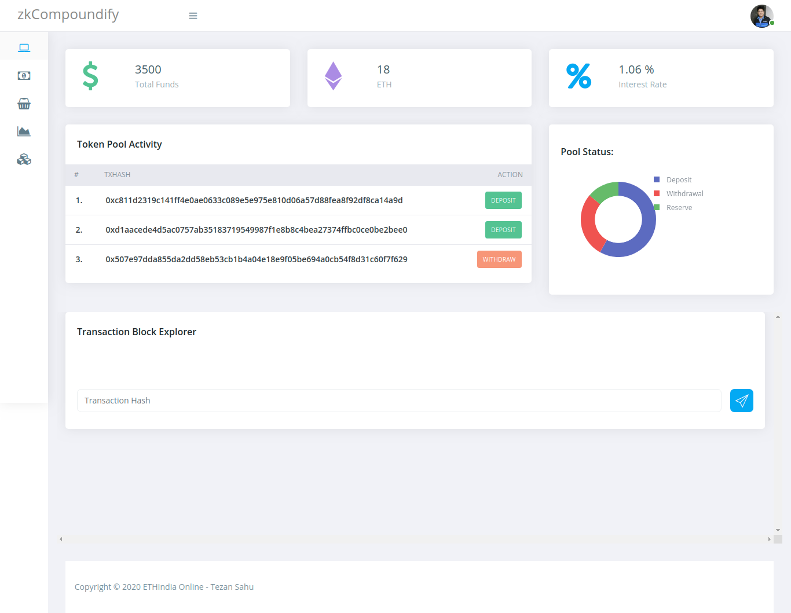

<h1 align="center">zkCompoundify </h1>
<p align="center"> Zero-Knowledge Lending with Compound Protocol</p>

***

### Problem Statement:

Currently, in the Blockchain Ecosystem, everything that we do is open and visible to all, which is good for some applications but really not appreciated for others: especially the ones that involve __high-value transactions__. There is currently no lending protocol that offers built-in privacy for preserving the transaction amount of loans and borrows carried out by the lenders and borrowers respectively.


### Our Solution: zkCompoundify



<br />
<br />
Provided here is a novel solution using zero-knowledge proofs that helps us achieve complete privacy on the MATIC plasma chain. In this solution, the stakeholders can avail of the services of the platform in complete confidentiality and can still prove its correctness. This is done by integrating AZTEC Protocol with the Compound Finance Protocol.


#### Challenges I ran into

I land up in a lot of challenges during the project, some of which are:

1) Understanding the nuances of the Compound Protocol.

2) Working with AZTEC caused me some trouble as their library has changed a lot since I had started working with it. However, I was able to deal with them. 

3) I had issues with working with Web3 as we needed to interface it with Aztec.js for Zero-Knowledge Transactions.

#### How to run?

```bash
$ git clone https://github.com/tezansahu/zkCompoundify
$ cd zkCompoundify
$ yarn install

# Follow the next step to run on local node
$ ganache-cli -m 'differ idle retire demise glare sentence glove hammer iron mango way empty'

# On a new terminal
$ cd zkCompoundify
$ truffle migrate # To run on local node
# Or, to run on Matic Network
$ truffle migrate --network matic

# On a new terminal
$ cd zkCompoundify/client
$ live-server dashboard
# Install this if not already installed using `npm install live-server`

# On a new terminal
$ cd zkCompoundify
$ node server.js
```


***

<p align="center">Created with :heart: by Tezan Sahu</p>